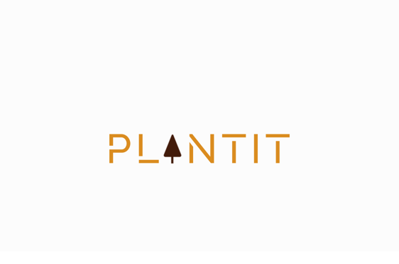

---

### Plant It

- [Step 1. Initializing project](./docs/hw1.md)
- [Step 2. gRPC connectivity check communication](./docs/hw2.md)
- [Step 3. Docker image](./docs/hw3.md)
- [Step 4. Persistence storage via Kubernetes](./docs/hw4.md)
- [Step 5. Database setup](./docs/hw5.md)
- [Step 6. CRUD operations](./docs/hw5.md)
