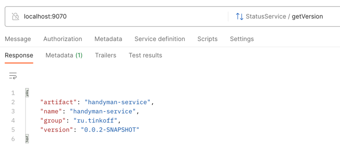
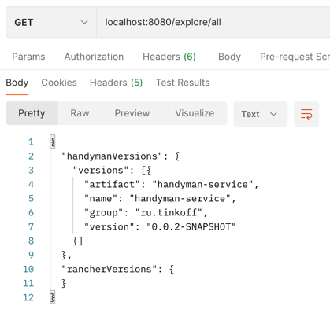
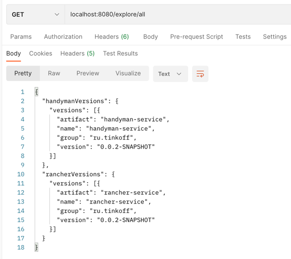

# Step 2

### Description

- Another step is to check connectivity between services. gRPC protocol was used. There is [common-grpc-connectivity](../common-grpc-connectivity) module for common usage. In [Landscape](../landscape-service) module there is an additional proto file to define answer for connectivity for all another services. 
- Landscape service is gRPC client.
- Handyman and Rancher services are gRPC servers.

### Project building:

- Complete project building from [Step 1](hw1.md)
- All proto codegen tasks will executed automatically


### Result

- Handyman and Rancher services has gRPC servers, so a request is available:
```bash 
grpcurl --plaintext localhost:9070 list
grpcurl --plaintext localhost:9090 list
```
```bash
grpcurl --plaintext localhost:9070 list ru.tinkoff.StatusService
```
```bash
grpcurl --plaintext localhost:9070 ru.tinkoff.StatusService.getVersion
grpcurl --plaintext localhost:9090 ru.tinkoff.StatusService.getVersion
```


- Plaintext is used instead of TLS/SSL secure method.


- Landscape service has gRPC client, so REST endpoint is available:
```bash 
curl -X GET localhost:8080/explore/all
```


