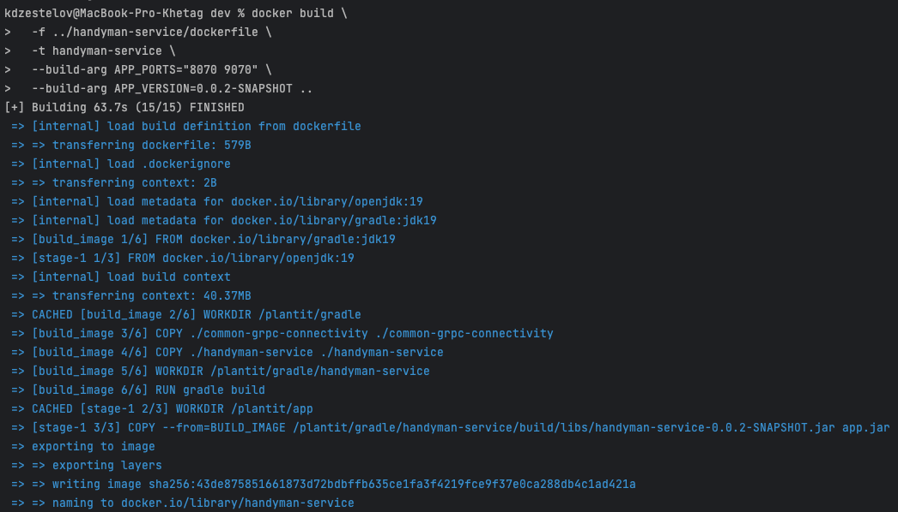
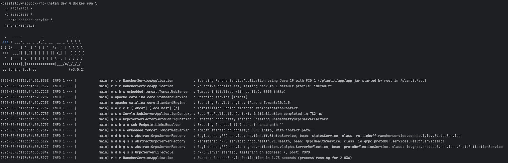
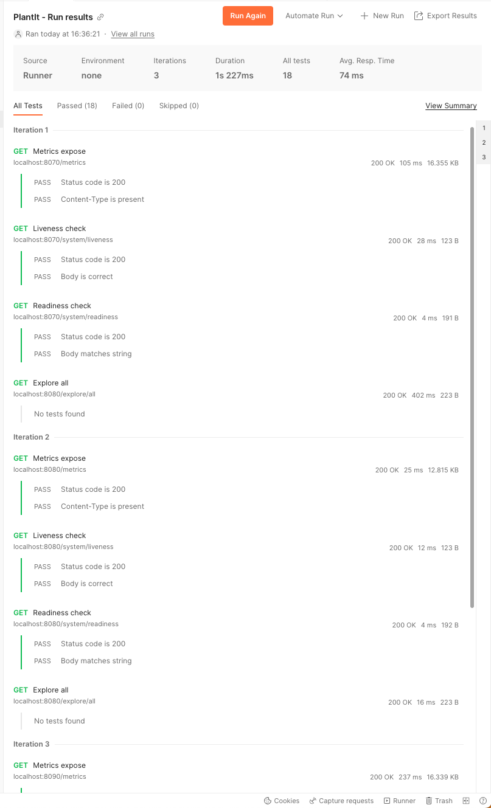
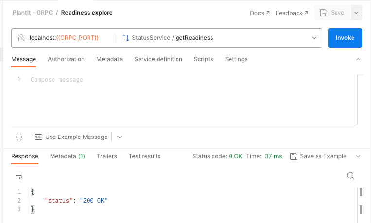
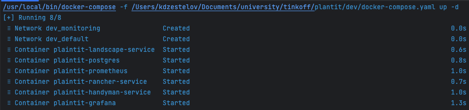

# Step 3 - Docker image

### Description

Each of the projects can be packed with docker image, and then run as Docker container.
The shared library [common-grpc-connectivity](../common-grpc-connectivity) is used.

### Building docker images:

- Use dev [README.md](../dev/README.md)

### Result

- Building docker image:

- Running container:

- Checking port-forwarding for all containers with Postman testing:

- Running all containers with docker-compose:

