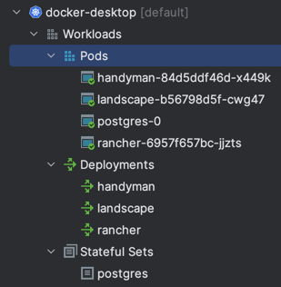

# Step 4 - Database via Kubernetes

### Description

- There are different approaches of application architecture as Stateful and Stateless.
- [Kubernetes](https://kubernetes.io) will be used for containers orchestration.
  - Persistence storage is represented with Persistence Volume ([PV](../dev/k8s/postgres-pv.yaml)) on filesystem provisioner.
    - As soon as [deployment configuration](../dev/k8s/unused/deployment-postgres.yaml) sets up stateless replicaset, statelfulset [configuration](../dev/k8s/postgres-statefullset.yaml) is used for postgres.
    
### Project building:

- Use k8s [README.md](../dev/k8s/README.md)

### Result

- Start:


- Kubernetes workload:



- Postgres container:

```console
root@postgres-0:/# psql postgresdb -U admin

postgresdb=# SELECT (23 * 3);
?column?
----------
       69
(1 row)
```